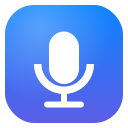

<!-- markdownlint-disable MD033 MD041 -->
<p align="center">
  
</p>

<h1 align="center">Kiro Web Voice</h1>

<p align="center">
  <em>Push-to-talk voice input and optional read-aloud for <a href="https://app.kiro.dev/">Kiro Web</a>.</em><br>
  <sub>Chrome (Manifest V3) proof-of-concept — not an official Kiro product.</sub>
</p>

<p align="center">
  
  
  
</p>

---

## なぜ作ったか

[Kiro Web](https://kiro.dev/docs/web/) はブラウザ上で動く会話型コーディングエージェントですが、公開ドキュメントの範囲では音声入力・読み上げは提供されていません。GitHub の要望 [#3919](https://github.com/kirodotdev/Kiro/issues/3919) も 2026-07 時点で Open のままです。

この拡張機能は、公式対応が来るまでの間、次の 3 つを最小限のリスクで実現するための **概念実証 (PoC)** です。

1. **入力を音声で** — Push-to-talk、確認、Kiro の入力欄に挿入
2. **出力の選択肢を用意** — 「表示のみ／手動読み上げ／自動読み上げ」から選択
3. **安全に** — 自動送信は既定オフ、音声・文字起こしは端末外に送信しない

---

## 主な特徴

- **Push-to-talk**：フローティングボタン、または `Alt+K` で開始／停止。
- **文字起こしの確認**：認識結果を編集してから Kiro の入力欄に挿入。**自動送信は既定オフ**。
- **出力モード切替**：ポップアップから「表示のみ／手動読み上げ／自動読み上げ」を選択。
- **回答単位の読み上げ**：Kiro の回答横に「読み上げ」チップを表示。
- **コードブロックは既定で読み上げない**：長いコードで音声が破綻しないように。
- **Apple 風の UI**：`backdrop-filter` の半透明、スプリング風スケール、`prefers-reduced-motion / transparency / contrast` を全対応。
- **最小権限**：`https://app.kiro.dev/*` のみに限定、`<all_urls>` は使わない。
- **プライバシー**：ブラウザ標準の Web Speech API のみ使用。第三者クラウドへ音声を送らない。

## 動作環境

- Google Chrome 116 以降（推奨）
- Microsoft Edge（Chromium ベース）
- `SpeechRecognition` 非対応のブラウザでは、拡張ロード時にトースト警告を表示します。
- Firefox は `SpeechRecognition` を既定で無効化しているため未対応です。

## インストール（開発モード）

1. このリポジトリをクローンします。

   ```bash
   git clone https://github.com/hide-G/kiro-web-voice.git
   ```

2. Chrome で `chrome://extensions/` を開き、右上の **デベロッパーモード** を有効化します。
3. **パッケージ化されていない拡張機能を読み込む** をクリックし、クローンしたフォルダ (`kiro-web-voice/`) を選択します。
4. [https://app.kiro.dev/](https://app.kiro.dev/) を開き、右下の丸ボタンで音声入力を開始します。

初回のみ、Chrome がマイク使用の許可を求めます。**許可** を選ぶと以後は同じ生成元で自動的に利用できます。

## 使い方

### 音声で入力する

1. 右下の「話す」ボタン、または `Alt+K` を押します。
2. 話し終えたら、もう一度ボタンを押して停止します。
3. 表示されたシートで文字起こしを確認・修正します。
4. **入力欄へ挿入** を押すと Kiro の入力欄に反映されます。送信はご自身のタイミングで行います。

送信まで自動で行いたい場合は、ポップアップで **挿入時に自動送信** をオンにしてください。ただし **誤認識時のリスク** を理解した上でご利用ください。

### 回答を読み上げる

- Kiro の直近の回答に **読み上げ** チップが表示されます。押すと読み上げ、もう一度押すと停止します。
- `Alt+Shift+K` で最新回答をそのまま読み上げます。
- ポップアップで出力モードを **自動読み上げ** に変更すると、Kiro の回答完了を検出して自動で読み上げます（実験的）。

### 出力モード

| モード | 動作 |
| --- | --- |
| 表示のみ | 従来の Kiro Web と同じ挙動。読み上げ機能を無効化。 |
| 手動読み上げ | 各回答の横に「読み上げ」チップを表示（既定）。 |
| 自動読み上げ | 新しい回答が表示されたら自動で読み上げ（実験的）。 |

## アーキテクチャ

```text
                 ┌───────────────────────────────┐
                 │ chrome.storage.sync (settings)│
                 └───────────────┬───────────────┘
                                 │
                     GET / SET   │   commands
                                 │
┌──────────────────┐   messages  │   ┌────────────────────────────┐
│  Popup (module)  │◀────────────┼──▶│    Service Worker (SW)     │
│  settings UI     │             │   │  MV3 background, module ESM │
└──────────────────┘             │   └────────────────────────────┘
                                 ▼                     ▲
                     ┌────────────────────────┐        │
                     │  Content Script (IIFE) │────────┘
                     │  app.kiro.dev only     │
                     │                        │
                     │  • Shadow DOM UI       │
                     │  • Composer adapter    │
                     │  • Message extractor   │
                     │  • Web Speech API      │
                     │  • Speech Synthesis    │
                     │  • Tiny spring engine  │
                     └────────────────────────┘
```

主要ファイルは [`docs/ARCHITECTURE.md`](docs/ARCHITECTURE.md) を参照してください。

## セキュリティとプライバシー

- 音声データは **ブラウザ内部の音声認識サービスのみ** に渡ります。この拡張は音声・文字起こしを **独自の外部サーバーへ送信しません**。
- 生音声・文字起こし・Kiro の応答を **保存しません**。すべてメモリ上でのみ扱います。
- クリップボード読み取り権限、`<all_urls>`、`activeTab` は **要求しません**。ホスト権限は `https://app.kiro.dev/*` のみです。
- Chrome の内部音声認識実装によっては、音声がブラウザベンダーの音声認識サーバーに送られる場合があります（MDN 参照）。オンデバイス処理が必要な用途では、この点を事前に評価してください。

詳細は [`docs/SECURITY.md`](docs/SECURITY.md) を参照してください。

## 制限事項

- Kiro Web の **DOM 構造に依存** します。UI が更新されると入力欄検出やメッセージ抽出が壊れる可能性があります。安全側に倒すため、入力欄が見つからない場合はクリップボードへコピーします。
- ストリーミング表示の Kiro 回答について、自動読み上げの「完了判定」は 800ms のデバウンスで近似しています。正確ではありません。
- 現状は日本語と英語をメインに検証しています。他言語での認識精度は未検証です。
- テストコードは未整備です。

## ロードマップ

- [ ] Composer adapter のフォールバック手段強化（クリップボード、Selection API）
- [ ] TTS の音声プロバイダーを差し替え可能に（ブラウザ標準 → クラウド）
- [ ] STT の音声プロバイダーを差し替え可能に（Web Speech API → クラウド）
- [ ] `data-testid` 相当の Kiro 側公式拡張ポイントへの対応
- [ ] Firefox 対応（Speech Recognition の有効化を検討）
- [ ] E2E テスト（Playwright）とユニットテスト（Vitest）
- [ ] ユーザ辞書（技術用語置換）
- [ ] 送信前の音声フィードバック（ハプティクスは Web では非対応。代わりに micro-sound）

## 貢献

Issue と Pull Request を歓迎します。ただしこれは PoC のため、**Kiro 側が公式に音声対応した時点で本リポジトリの開発は停止する** 前提でお使いください。

- [公式要望への投票 (Feature: TTS and STT #3919)](https://github.com/kirodotdev/Kiro/issues/3919)

## ライセンス

MIT License — [`LICENSE`](LICENSE) を参照してください。

## 免責事項

本拡張は Kiro / Amazon Web Services とは無関係です。「Kiro」および関連商標は AWS の所有物です。本拡張の利用にあたっては、Kiro および AWS の利用規約を必ずご確認ください。
